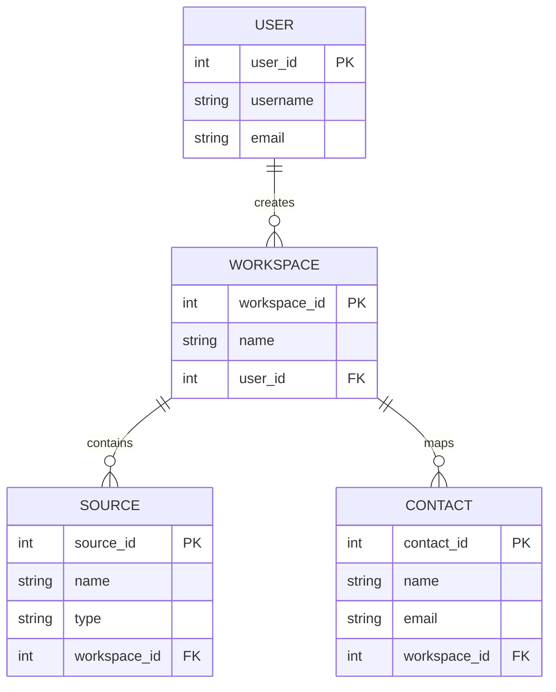

# Entity Relationship Diagram for Workspace System

This document contains an Entity-Relationship (ER) diagram created using Mermaid to illustrate the relationships between Users, Workspaces, Sources, and Contacts.

## ER Diagram

## Explanation
- **USER**: Represents a user who can create workspaces. Attributes include `user_id` (primary key), `username`, and `email`.
- **WORKSPACE**: Represents a workspace created by a user. Attributes include `workspace_id` (primary key), `name`, and `user_id` (foreign key referencing USER).
- **SOURCE**: Represents a source within a workspace. Attributes include `source_id` (primary key), `name`, `type`, and `workspace_id` (foreign key referencing WORKSPACE).
- **CONTACT**: Represents a contact mapped to a workspace. Attributes include `contact_id` (primary key), `name`, `email`, and `workspace_id` (foreign key referencing WORKSPACE).
- **Relationships**:
  - A USER can create zero or many WORKSPACES (`||--o{`).
  - A WORKSPACE can contain zero or many SOURCES (`||--o{`).
  - A WORKSPACE maps to zero or many CONTACTS (`||--o{`).

## Download
To download this Markdown file, copy the