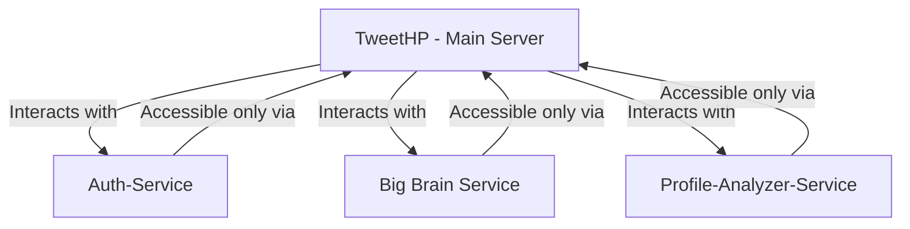

# Service Architecture Diagram

The following Mermaid diagram illustrates the architecture where the TweetHP main server interacts with three services: Auth-Service, Big Brain Service, and Profile-Analyzer-Service. These services are only accessible via the TweetHP main server.

